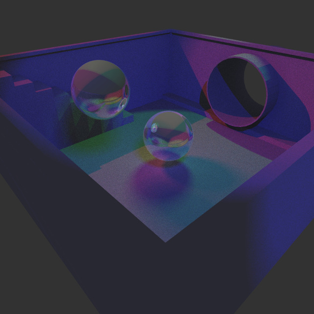
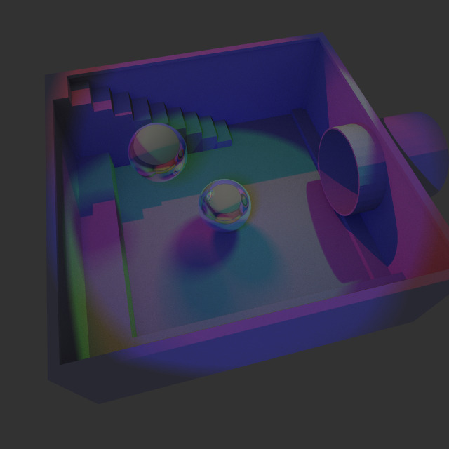

# CudaRayTracer

A simple raytracer implemented in C++ and CUDA as a portfolio project. Currently it only supports execution on one CUDA enabled GPU. Permits spot lights and loading of .obj files. 

This was created as a personal project and I'm fairly proud of how far it's come. Perhaps not the most efficient implementation but the results are very pretty. In the future I would like to support texture maps, normal maps and photon mapping but for now I will upload as is.

Some example images:

scewer_scene_detail.obj rendered with 64 and 2048 samples.
Rendered with a Nvidia Quadro RTX 5000 GPU

### 64 Samples

### 2048 Samples

